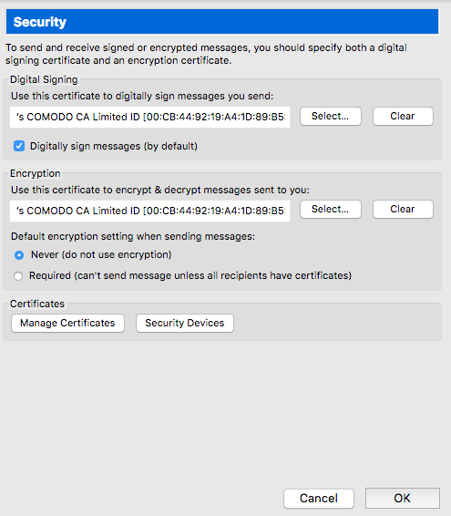
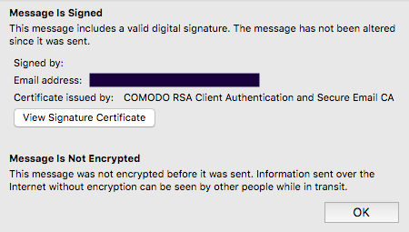

# Intro
> S/MIME (Secure/Multipurpose Internet Mail Extensions) is a standard for public key encryption and signing of MIME data. S/MIME is on an IETF standards track and defined in a number of documents, most importantly RFCs 3369, 3370, 3850 and 3851. It was originally developed by RSA Data Security Inc. and the original specification used the IETF MIME specification with the de facto industry standard PKCS#7 secure message format. Change control to S/MIME has since been vested in the IETF and the specification is now layered on Cryptographic Message Syntax, an IETF specification that is identical in most respects with PKCS #7. S/MIME functionality is built into the majority of modern email software and interoperates between them.

S/MIME provides several cryptographic security services for electronic messaging communication. Some of these include

* Authentication
* Message integrity
* Non-repudiation of origin (using digital signatures)
* Privacy
* Data security (using encryption)
* S/MIME specifies the MIME type application/pkcs7-mime (smime-type "enveloped-data") for data enveloping (encrypting) where the whole (prepared) MIME entity to be enveloped is encrypted and packed into an object which subsequently is inserted into an application/pkcs7-mime MIME entity.

## Obtain Email Certificate
[COMODO](https://www.comodo.com/home/email-security/free-email-certificate.php) offers free email certificates that are valid for 1 year. Their [email certificate application](https://goo.gl/ZTqZ53) only asks for some basic info including a revocation password in the event you need to revoke the certificate. Make sure to _not_ use Google Chrome because Google has removed key generation from the popular web browser. Instead, I found using Firefox and presumably other web browsers works just fine. When completing the application using Firefox a drop-down dialog message will appear to confirm the certificate was successfully installed. 

In Firefox `Preferences -> Advanced -> Certificates` select _View Certificates_ to open the Certificate Manager. Under _Your Certificates_ we will see the `COMODO CA Limited` email certificate. Select the email address right below the _Certificate Name_ and then the `Backup...` button. The format will default to PKCS12. This is the format we want so it can be imported into a mail client such as Mozilla Thunderbird. This also works fine with Microsoft Outlook, Apple Mail as of 10.12 Sierra and probably others.

## Thunderbird
With Thunderbird we can go into `Account Settings -> Security`.

When you click the _Select_ button under _Digital Signing_ the certificate will be found. If you have more than 1 certificate you should be able to select the one you want. Using the above settings will always make outgoing email messages signed with S/MIME. 

We can verify an email message gets signed using our proud COMODO email certificate.

